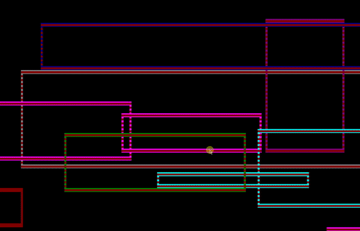

# ConsoleHelper

- Library for Console painting - for simple program learning;
- Demo: ConsoleHelper.Demo.Run(); in Demo.cs
- Methods:
-		FullScreen()
- 		DrawCircle(...)
-		Random methods
-		Write(...)
-		DrawTriangle(...)
-		DrawEllipse(...)
-		DrawLine(...)
-		MoveRectangle(...)
-		Wait(...)
-		Animator class - simple animation in Console application(...)

# Demo

